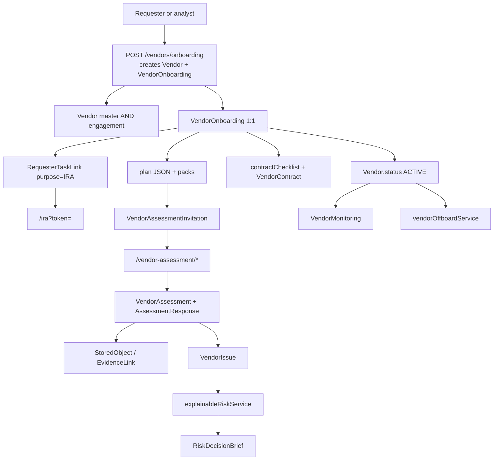

# #12 TPRM Golden Journey Reconciliation

**Phase:** 0 — architecture lock. No implementation.  
**Branch:** `supreme-risk-transformation`  
**HEAD at audit:** `5a9d7512378d048dce7214ece6f6106bef886368`  
**Item:** #12 reopened by Product Leadership for total TPRM revamp / Golden Journey reconciliation.  
**Prior #12 work:** preserve unless this audit proves a conflict.  
**#13–#22:** accepted at current-stage statuses.  
**#23 Insurance Phase A/B:** accepted for current stage. Do not extend. Do not break Insurance → Third Party / Risk / Evidence / Graph.  
**#24–#38, #40:** not authorized.  
**UI 2.0 / Enterprise Record Standard:** parallel quality standard.  
**Production / commercial GO:** NO.

**Authoritative operating model:** Product Leadership Golden Journey in the Phase 0 brief (canonical PDF `Supreme_GRC_TPRM_Industry_Standard_Research_Report(1).pdf` was not present in the repository or `docs/tprm/` at audit time). Supporting accepted ADRs remain in force unless this document names a conflict:

- `docs/ADR-0001-phase-a-tprm-explainability.md` — one residual scorer; acceptance does not reduce residual
- `docs/ADR-TPRM-INHERENT-RISK-SCORING.md` — Version 3 IRA
- `docs/ADR-TPRM-VENDOR-ACCESS.md` — bounded `VENDOR` plane
- `docs/ADR-TPRM-PHASE-C-LIFECYCLE.md` — lifecycle orchestration on existing models
- `docs/ADR-TPRM-WORKBOOK-RECONCILIATION.md` — pack mapping
- `docs/ADR-TPRM-REQUESTER-TASK-LINKS.md` — requester secure links

This document does not replace the research report. It does not authorize coding.

---

## 1. Non-negotiable principles (locked)

1. **Third Party ≠ Engagement.** `Vendor` today is both. That is the central architectural conflict.
2. **Intake is first-class.** Do not use `Vendor` as Intake.
3. **Assignment precedes analyst triage.**
4. **IRA ≠ Intake ≠ Vendor questionnaire.**
5. **Vendor never sees requester IRA.**
6. **Question → Response → Evidence → Assessor review → Finding (if warranted) → Control effectiveness → Residual.** A negative answer is not automatically a risk.
7. **Humans remain authoritative** for tier, effectiveness, treatment, acceptance, contract exceptions, and applicability.

---

## 2. Current architecture (what the repository actually has)

Supreme today is a **Vendor-centric lifecycle**. Creating a Third Party request immediately creates:

- one `Vendor` (master + engagement facts mixed)
- one `VendorOnboarding` (**1:1**, `vendorId @unique`)
- a display string `engagementPublicId` such as `ENG-{id}-01` — **not a model**

There is **no** `IntakeRequest` and **no** `Engagement` table.

### Inventory (minimum objects)

| Current object | Kind | Scope today |
| --- | --- | --- |
| `Vendor` | EXISTING | Legal identity **and** service, owners, IRA-driven tier, residual, monitoring, offboarding |
| `VendorOnboarding` | EXISTING | Entire case state machine; 1:1 with Vendor |
| `engagementPublicId` | EXISTING field | Label only |
| `RequesterTaskLink` | EXISTING | IRA (implemented). `CLARIFICATION` enum unused |
| `VendorAssessment` / `AssessmentResponse` | EXISTING | N:1 Vendor; intake IR path **or** vendor DD |
| `VendorAssessmentInvitation` / `VendorPortalSession` / `VendorContact` | EXISTING | Bounded vendor plane |
| `VendorDueDiligenceScope` | EXISTING 1:1 | Parallel to onboarding `plan` JSON; underused |
| `StoredObject` / `EvidenceLink` / `VendorDocument` | EXISTING | Shared evidence; vendor- or org-owned |
| `VendorIssue` + Finding Workspace | EXISTING | Engagement-unaware; vendor-scoped |
| `VendorRiskControl` | EXISTING | Effectiveness enum; not the residual path |
| `ScoreCalculation` / `explainableRiskService` | EXISTING | Vendor residual; explainable factors |
| `RiskDecisionBrief` | EXISTING | Immutable snapshot; `engagementName` string |
| `VendorContract` / onboarding `contractChecklist` | EXISTING | Attest/record, not CLM |
| `VendorMonitoring` | EXISTING | Vendor signals |
| `VendorExitRiskAssessment` / `VendorExitClosure` / `vendorOffboardService` | EXISTING | Vendor-level offboard; acknowledge outstanding |
| `GovernanceNode` / `GovernanceEdge` | EXISTING | VENDOR, ASSESSMENT, FINDING, EVIDENCE, CONTRACT |
| `InAppNotification` / email / `AuditEvent` | EXISTING | Queued ≠ Delivered |
| `InsuranceVendorClassification` | EXISTING | **Depends on `Vendor.id`** — must keep Third Party identity stable |

### Frontend routes (current)

Work: `/vendor-management`, `/vendor-onboarding`, `/vendor-onboarding/:id`, `/assessments`, `/findings`, `/decision-briefs`.  
Programs: `/monitoring`. Governance: `/documents`. Public: `/ira`, `/vendor-assessment/*`.  
**No** Intake Queue, **no** lead-assignment workspace, **no** My TPRM Work, **no** Engagement register.

### Dual intake paths (conflict)

1. **Requester IRA (Version 3)** — `iraAnswers` JSON on `VendorOnboarding`; secure link; Don't-know honesty; floors; pack plan. This is the accepted Golden path.
2. **Internal intake assessment** — `intakeAssessmentId` + `completeIntake` on IR-01–15 template. Still present. Must not remain a second authoritative IRA.

---

## 3. Target architecture

```mermaid
flowchart LR
  subgraph channels [Intake channels]
    form[SUPREME_FORM]
    email[EMAIL]
    snow[SERVICENOW]
    jira[JIRA]
    proc[PROCUREMENT]
    api[PUBLIC_API]
  end
  channels --> intake[IntakeRequest]
  intake --> queue[Intake Queue]
  queue --> assign[Lead assignment]
  assign --> triage[Assigned analyst triage]
  triage --> match[Third Party search / match / create]
  match --> tp[ThirdParty = current Vendor master]
  triage --> eng[Engagement]
  intake --> eng
  tp --> eng
  eng --> ira[InherentRiskAssessment]
  ira --> tier[TierDecision]
  tier --> plan[DueDiligencePlan]
  plan --> vq[Vendor Assessment]
  vq --> ev[Evidence]
  ev --> find[Finding]
  find --> ce[ControlEffectiveness]
  ce --> rr[ResidualRisk]
  rr --> treat[Treatment / Acceptance]
  treat --> gate[ContractGate]
  gate --> active[ACTIVE Engagement]
  active --> mon[MonitoringProfile]
  active --> re[Reassessment cycle]
  active --> term[Termination / Offboarding]
```

**Third Party** (`Vendor`, keep table name initially): legal name, domain, headquarters, enterprise contacts, corporate identifiers, global intelligence, Insurance classification, Privacy processor identity.

**Engagement** (NEW): one service/relationship. Owns IRA, tier, plan, assessments, evidence mappings, findings, effectiveness, residual, treatment, contract gate, monitoring profile, reassessment history, termination, offboarding, disposition. Links to originating `IntakeRequest`.

**IntakeRequest** (NEW): business need only. Does not become the vendor.

---

## 4. Target domain objects

| Object | Verdict | Why |
| --- | --- | --- |
| IntakeRequest | **NEW** | Missing. Vendor is not Intake. |
| IntakeAssignment / AssignmentHistory | **NEW** | No assign/reassign/SLA/workload audit today. |
| IntakeCommunication | **EXTEND** via requester links + notes | Don't invent a second comms product. Use task links + audit for clarification. |
| ThirdParty | **EXISTING** as `Vendor` | Rename in product language first; keep Prisma `Vendor` in Wave 1 to protect Insurance/Graph/Evidence FKs. |
| Engagement | **NEW** | `engagementPublicId` is not architecture. |
| EngagementParty | **EXTEND** existing user/contact FKs | Requester, business owner, analyst, relationship owner, vendor contact already exist as fields/models. Add `assignedAnalystUserId` on Engagement. |
| RequesterTask | **EXISTING** `RequesterTaskLink` | Preserve token architecture. |
| RequesterTaskRevision / IraResponseRevision | **NEW** | Clarification must not overwrite `iraAnswers`. |
| InherentRiskAssessment | **EXTEND** `VendorOnboarding` IRA fields → Engagement | Do not rebuild Version 3 scoring. |
| IraResponse | **EXTEND** `iraAnswers` into versioned rows | JSON map is enough for v1 if revisions are appended. Prefer versioned rows for audit. |
| TierRecommendation / TierDecision | **EXISTING** on onboarding | Move to Engagement. Keep confirm/override/floors. |
| DueDiligencePlan | **EXISTING** `plan` JSON | Keep explain-why packs. Optionally later promote `VendorDueDiligenceScope`. **MERGE** scope table into plan over time; do not run two plans. |
| Assessment / AssessmentResponse / AssessmentReview | **EXISTING** | Re-scope to Engagement. Preserve vendor portal + `respondentPlane`. |
| EvidenceObject / EvidenceReview / EvidenceMapping | **EXISTING** StoredObject + EvidenceLink | Add `engagementId`. Do not duplicate storage. |
| Finding / RemediationPlan / Verification | **EXISTING** VendorIssue + Finding Workspace | Add `engagementId`. Do not rebuild the workspace. |
| ControlEffectivenessAssessment | **EXTEND** | Residual already derives effectiveness from responses. Need an **authoritative human rating** (EFFECTIVE / PARTIALLY_EFFECTIVE / INEFFECTIVE / NOT_APPLICABLE). `VendorRiskControl` exists but is not the residual path. **Do not** auto-create a parallel scorer. |
| CompensatingControl | **EXTEND** VendorException / brief conditions | Record on treatment/acceptance; do not auto-lower residual. |
| ResidualRiskAssessment | **EXISTING** ScoreCalculation | Re-scope to Engagement. Preserve ADR-0001. |
| RiskTreatment / RiskAcceptance | **EXISTING** RiskDecisionBrief + finding acceptance | Extend treatments MITIGATE/AVOID/TRANSFER/ACCEPT. |
| ContractRequirement / ContractGate | **EXTEND** contractChecklist + VendorContract | Record/attest/integrate. Not a contract-authoring system. |
| MonitoringProfile / MonitoringSignal | **EXTEND** VendorMonitoring | Profile per Engagement; reuse #19 / #20 / #22. Signals must not silently rewrite residual. |
| Reassessment | **EXTEND** `startReassessment` | New cycle linked to prior; do not overwrite. |
| TerminationRequest / OffboardingCase / OffboardingTask | **EXTEND** offboard + exit models | Need task gates; today acknowledge-and-terminate is too coarse. |
| FinalDisposition | **EXTEND** VendorStatus + onboarding stage | Per Engagement. Third Party stays ACTIVE if other engagements exist. |
| AuditEvent | **EXISTING** | Keep. |

**DO NOT NEED as new products:** second findings system, second evidence store, second residual engine, second vendor identity plane, Graph database.

---

## 5. Intake operating model

**Target flow:** Requester → connected channel → `IntakeRequest` → acknowledgement → TPRM Intake Queue → lead assignment → analyst triage → match/create Third Party → create Engagement → intake complete.

### Recommended IntakeRequest states

Do **not** copy IRA/vendor stages onto Intake.

| State | Use |
| --- | --- |
| SUBMITTED | Channel accepted; acknowledgement sent |
| UNASSIGNED | In queue; no analyst |
| ASSIGNED | Lead assigned an analyst |
| IN_REVIEW | Analyst triaging |
| NEEDS_INFORMATION | Waiting requester (not IRA) |
| READY_FOR_MATCH | Enough to search Third Party |
| VENDOR_MATCHED | Third Party selected/created |
| ENGAGEMENT_CREATED | Intake done; case lives on Engagement |
| CANCELLED / REJECTED / DUPLICATE | Terminal |

**Rejected from the briefed list for Intake:** `IRA_SENT`, `COMPLETED` as IRA-complete. Those belong on **Engagement**. Putting them on Intake recreates today's mixed state machine.

Wave 1 channel: **SUPREME_FORM** only. EMAIL / SERVICENOW / JIRA / PROCUREMENT / PUBLIC_API are adapters onto the same object later (#22 live providers remain deferred).

### Assignment

Leadership capability (not a new job-title Role unless PL requires it):

- Map **TPRM Manager / Team Lead** → `RISK_MANAGER` + `ORGANIZATION_ADMIN` with new permission `intake.assign`
- Assign / reassign / due / priority / note / workload / full assignment audit

Analyst **My TPRM Work** reuses `attentionService` + Engagement assignment filter. Do not invent a second queue product.

---

## 6. Third Party vs Engagement finding

**The schema does not separate them.** `VendorOnboarding.vendorId` is unique. One vendor = one implicit engagement.

### Engagement-specific state currently on Vendor / Onboarding

| Field / relation | Classification |
| --- | --- |
| `tier`, `confirmedTier`, IRA answers, floors, plan | **ENGAGEMENT** |
| `inherentRiskScore`, `residualRiskScore`, `ScoreCalculation` | **ENGAGEMENT** |
| `businessOwner*`, `requester*`, `servicesProvided`, `targetStartDate` | **ENGAGEMENT** (owner may also be portfolio-level) |
| `VendorAssessment`, `VendorIssue`, invitations | **ENGAGEMENT** |
| `nextReviewDate`, reassessment cadence | **ENGAGEMENT** |
| approval / contract checklist / activation | **ENGAGEMENT** |
| `VendorMonitoring` | **ENGAGEMENT** (signals may also be firm-wide) |
| Offboarding / exit | **ENGAGEMENT** first; Third Party only if last engagement |
| `name`, `legalName`, `domain`, `website`, `country`, identifiers | **GLOBAL THIRD PARTY** |
| `VendorContact` enterprise contacts | **GLOBAL** (assessment contact is engagement-assigned) |
| Insurance classification, Privacy processor | **GLOBAL THIRD PARTY** |
| `estimatedAnnualSpend` / `contractValue` | **AMBIGUOUS** — often engagement |

---

## 7. IRA + clarification loop

**Preserve:** hashed requester links, Version 3 scoring, Don't-know → Not yet rated, floors, vendor-never-sees-IRA, auto-confirm Low rules.

**Missing:** question-specific requester clarification. `RequesterTaskPurpose.CLARIFICATION` exists and is unused. Vendor-plane clarification (`clarificationQuestionIds`) must stay **vendor-only**.

Target:

1. IRA_SENT → open → submit → TIER_REVIEW
2. Analyst CONFIRM / OVERRIDE / REQUEST CLARIFICATION
3. Clarification is question-specific: questions, note, due, optional general note
4. Requester page: **ACTION REQUIRED — CLARIFICATION REQUESTED**
5. Persist previous answer, revised answer, request, requestedBy/At, response, respondedAt, revision number
6. Re-run only affected IRA logic
7. Analyst sees before/after, tier/pack/floor impact
8. Loop may repeat. **No tier confirmation while required clarification is open.**

---

## 8. Golden Journey matrix

Status: COMPLETE / PARTIAL / MISSING / CONFLICTING.

| # | Stage | Business purpose | Primary actor | Supporting | Required object | Current object | Current route | Current API/service | Current states | Notifications | Audit | Graph | Status | Preserve | Extend | Migrate | Replace | Gap | Target |
| --- | --- | --- | --- | --- | --- | --- | --- | --- | --- | --- | --- | --- | --- | --- | --- | --- | --- | --- | --- |
| 1 | Business Need | Capture why a service is needed | Requester | Business Owner | IntakeRequest | Implicit fields on create | `/vendor-onboarding` | `createOnboardingRequest` | n/a | none dedicated | `vendor` create | none | **PARTIAL** | Create form fields | Split from Vendor create | Need → IntakeRequest | Do not keep Vendor-as-need | No standalone need record | IntakeRequest.need |
| 2 | Intake Submission | Open a governed request | Requester | Channel | IntakeRequest | Vendor+Onboarding created immediately | `/vendor-onboarding` | same | INTAKE | in-app limited | AuditEvent | OWNS Vendor | **CONFLICTING** | Duplicate-name check | Channel enum | Vendor create after match | Creating Vendor at submit | No Intake object | IntakeRequest SUBMITTED |
| 3 | Intake Queue | Work intake before IRA | TPRM Lead | Analysts | IntakeRequest queue | Open work list (onboarding) | `/vendor-onboarding` | `listOnboardings` | mixed lifecycle stages | Dashboard attention | none queue-specific | none | **PARTIAL** | Open work UX | Filter UNASSIGNED | — | Using onboarding as queue | No assignment states | Intake Queue |
| 4 | Lead Assignment | Own the case before triage | TPRM Manager/Lead | — | IntakeAssignment | optional businessOwner on create | none | none | n/a | none | none | none | **MISSING** | — | permission `intake.assign` | — | Analyst self-pick as default | No assign/reassign/workload | AssignmentHistory |
| 5 | Analyst Triage | Enough info to match vendor | Assigned analyst | Requester | IntakeRequest IN_REVIEW | Analyst is creator | workspace | `presentOnboarding` | INTAKE | attention | audit | none | **PARTIAL** | Workspace attention | Assignment-required | — | — | Unassigned pickup | My Work → assigned only |
| 6 | Third Party Search / Match | Reuse enterprise master | Analyst | — | ThirdParty | `findDuplicateVendors` name/domain | create 409 | `findDuplicateVendors` | 409 duplicates | none | none | none | **PARTIAL** | Duplicate detect | Search UI + match reason | — | — | Match is create-time only | Search before create |
| 7 | Third Party Create | New legal entity | Analyst | — | ThirdParty | `Vendor` create | `/vendor-management` add | `createVendor` / onboarding | UNRATED | snackbar | audit | VENDOR node | **PARTIAL** | UNRATED honesty | Create only after match miss | — | — | Create still starts engagement | Create Third Party only |
| 8 | Engagement Create | Scope the service | Analyst | Requester | Engagement | `engagementPublicId` string | none | set at onboarding create | always `-01` | none | none | none | **MISSING** | Display id idea | Real Engagement | Move onboarding onto Engagement | String-as-engagement | Cannot model M365 vs Azure | Engagement 1:N ThirdParty |
| 9 | Intake Completion | Close intake; case continues | Analyst | — | Intake ENGAGEMENT_CREATED | Intake never closes separately | workspace | stage INTAKE→IRA | INTAKE | — | — | — | **MISSING** | — | Terminal intake states | — | — | Intake = whole lifecycle | Split machines |
| 10 | IRA Task Creation | Ask business context | Analyst | Requester | RequesterTask IRA | RequesterTaskLink | workspace | `sendIraLink` / copy | PENDING | email Queued | audit | none | **COMPLETE** enough | Token hash, revoke, copy≠sent | Bind to Engagement | vendorId → engagementId | — | — | Same link, Engagement FK |
| 11 | IRA Send | Deliver task | Analyst | Email | RequesterTask | same | workspace | send / mark sent | PENDING | Queued/Accepted ≠ Delivered | audit | none | **COMPLETE** | Honesty of delivery | — | — | — | Real inbox untested | Preserve |
| 12 | IRA Open | Requester starts | Requester | — | RequesterTask OPENED | `/ira?token=` | `RequesterIra` | `getIraForm` | OPENED | none to vendor | openedAt | none | **COMPLETE** | Public page | Clarification mode | — | — | — | Preserve + clarify mode |
| 13 | IRA Submit | Facts + impact in | Requester | — | InherentRiskAssessment | `iraAnswers` JSON | `/ira` | `submitIraForm` | TIER_REVIEW or auto LOW | notify analysts | audit | none | **COMPLETE** | v3 score, Don't-know | Version answers | Move off Vendor | Internal IR template path | Two IRA authorities | One IRA object |
| 14 | Tier Review | Human validates recommendation | Analyst | Lead | TierDecision | onboarding recommended/confirmed | workspace | `confirmTier` | TIER_REVIEW | attention | audit | none | **PARTIAL** | Floors, override reason | Clarification action | To Engagement | — | No question-level clarify | Confirm / override / clarify |
| 15 | Requester Clarification | Fix specific IRA answers | Analyst | Requester | RequesterTask CLARIFICATION | Enum unused | none | none | n/a | none | none | none | **MISSING** | Enum value | Implement purpose | — | Do not reuse vendor clarify | No IRA revision history | Question-specific loop |
| 16 | Clarification Response | Revised answers + history | Requester | Analyst | IraResponseRevision | none | none | none | n/a | none | none | none | **MISSING** | Don't overwrite | Revision rows | — | Mutating iraAnswers | No before/after | Revision + re-score affected |
| 17 | Tier Confirmation / Override | Authoritative tier | Analyst | Approver if material | TierDecision | `confirmTier` | workspace | same | DUE_DILIGENCE_PLAN / READY_TO_SEND | attention | audit | none | **COMPLETE** enough | Human confirm | Block if clarify open | Engagement.tier | — | Manual add once bypassed #12; now UNRATED | Preserve + Engagement |
| 18 | Due-Diligence Scope | Why these packs | Analyst | Specialists | DueDiligencePlan | `plan` JSON + QuestionnairePlan | workspace Assessment tab | `confirmPlan` | DUE_DILIGENCE_PLAN | none | audit | none | **PARTIAL** | Why-pack, 8-pack map | Reviewers, monitoring profile, cadence | Merge VendorDueDiligenceScope | Two scope models | Specialist path implicit | One plan on Engagement |
| 19 | Vendor Questionnaire Generation | Control/evidence DD | Analyst | Library | Assessment | Templates materialized | `/questionnaires` | `materializeReadyPlan` | READY_TO_SEND | none | audit | ASSESSMENT | **PARTIAL** | Risk-driven packs | Engagement scope | — | — | Pack noise if shown too early | Generate after tier |
| 20 | Vendor Send | 4a/4b send | Analyst | Vendor Contact | Invitation | invitation + email | workspace | `sendDueDiligence` | AWAITING_VENDOR | Queued≠Delivered | audit | none | **COMPLETE** | 4a/4b, contact required | Engagement | — | — | — | Preserve |
| 21 | Vendor Activation | Bounded session | Vendor Contact | — | VendorPortalSession | activate token | `/vendor-assessment/activate` | `activateVendorAccess` | ACTIVATED | none | audit | none | **COMPLETE** | ADR vendor plane | — | — | Vendor as User | — | Preserve |
| 22 | Vendor Response | Answers + evidence | Vendor Contact | — | AssessmentResponse | portal questionnaire | `/vendor-assessment/:id` | save/submit | VENDOR_IN_PROGRESS → SUBMITTED | notify | audit | none | **COMPLETE** | Attestation, no IRA | Engagement | — | — | — | Preserve isolation |
| 23 | Evidence Upload | Attach proof | Vendor / org | Malware | StoredObject | portal + `/documents` | both | uploadEvidence | scan PENDING/CLEAN | none | audit | EVIDENCE | **PARTIAL** | Fail-closed malware, org-owned | engagementId, question, expiry | — | Second store | Lineage incomplete | Shared evidence + mapping |
| 24 | Evidence Review | Usable ≠ uploaded | Analyst / reviewer | — | EvidenceReview | scan + finding evidence | Documents / finding | review APIs | Ready / blocked | attention expiring | audit | link | **PARTIAL** | Scan honesty | Reviewer result, review date | — | Equating upload with valid | Framework mapping sparse | Review result required |
| 25 | Specialist Review | Domain review | Cyber/Privacy/etc. | Analyst | AssessmentReview | ReviewDecidePanel | workspace Decisions | `reviewFinding` | UNDER_REVIEW | attention | audit | none | **PARTIAL** | Confirm/adjust/dismiss | Named specialist role on plan | — | — | No specialist queue | Plan-driven reviewers |
| 26 | Finding | Governed issue | Analyst | Vendor | Finding | VendorIssue + workspace | `/findings` | findingWorkspace | OPEN… | attention | audit | HAS_FINDING | **PARTIAL** | Finding Workspace Closure | engagementId | — | Rebuild workspace | Not engagement-aware | Preserve + Engagement |
| 27 | Remediation | Close the gap | Vendor / internal / shared | Analyst | RemediationPlan | CAP + validate + close | drawer | cap/validate/close | REMEDIATION | overdue | audit | REMEDIATED_BY | **PARTIAL** | Evidence-required close | Engagement | — | Silent close | — | Preserve policy |
| 28 | Control Effectiveness | Human + derived | Analyst | Specialists | ControlEffectivenessAssessment | Derived in residual engine; `VendorRiskControl` unused by engine | risk explanation | `explainableRiskService` | implicit | none | ScoreCalculation | CONTROL | **CONFLICTING** | Deterministic derivation | Human rating EFFECTIVE…NOT_APPLICABLE | Do not let VendorRiskControl become a second scorer | Enum has NOT_TESTED not NOT_APPLICABLE | No authoritative human CE | One CE record feeding residual |
| 29 | Residual Risk | Explainable leftover | Analyst | Risk Owner | ResidualRiskAssessment | Vendor scores | vendor drawer / tprm risk | recalculate | 0–100 + band | none | risk.recalculate | none | **PARTIAL** | ADR-0001, no inverse compliance | Engagement + drill drivers | — | Inverse formulas (removed on register) | Vendor-scoped | Engagement residual |
| 30 | Risk Treatment | MITIGATE/AVOID/TRANSFER/ACCEPT | Analyst / Owner | — | RiskTreatment | Finding CAP + accept | workspace | acceptFindingRisk | RISK_ACCEPTANCE | attention | audit | none | **PARTIAL** | Acceptance score-neutral | Named treatments | — | Treatment auto-lowering residual | No AVOID/TRANSFER objects | Treatment on Engagement |
| 31 | Risk Acceptance / Approval | Time-bounded exception | Approver | Analyst | RiskDecisionBrief | briefs + approval package | `/decision-briefs` | brief + `decideApproval` | APPROVAL | attention | immutable snapshot | DECISION | **PARTIAL** | Snapshot, expiry, residual unchanged | Engagement, authority level | — | Permanent exception | Maker-checker only if policy | Reuse briefs |
| 32 | Contract Requirements | Required clauses | Analyst / Legal / Procurement | — | ContractRequirement | checklist JSON + VendorContract | workspace | `attestContract` | jumps to APPROVAL | none | audit | CONTRACT | **PARTIAL** | Tier/plan-driven items | Structured requirements | — | Authoring CLM | CONTRACT_REVIEW never written | Record/attest gate |
| 33 | Contract Gate | Block ACTIVE if incomplete | Approver | Legal | ContractGate | Open findings block approval | `decideApproval` | same | APPROVAL | none | audit | none | **PARTIAL** | Finding block | Explicit gate state / exception | — | Attest skips CONTRACT_REVIEW | No exception object on gate | Gate or authorized exception |
| 34 | Engagement Activation | Service may start | Approver / Lead | — | Engagement ACTIVE | `activateVendor` Vendor.status | workspace | `activateVendor` | ACTIVE | none dedicated | audit | node status | **CONFLICTING** | Explicit activate | Activate Engagement not Third Party | Vendor.status portfolio rollup | Activating the legal entity | Multi-engagement impossible | Engagement ACTIVE; TP stays Active if any |
| 35 | Continuous Monitoring | Detect material change | Analyst / Automation | #19 #22 | MonitoringProfile | VendorMonitoring + ContinuousMonitoring | `/monitoring` | vendorContinuousMonitoring | requiresAction | attention | audit | none | **PARTIAL** | Signal ≠ residual rewrite | Per-engagement profile | — | Live ratings deferred | Thin signal set | Profile + materiality review |
| 36 | Scheduled Reassessment | Cadence review | Analyst | Requester/Vendor | Reassessment | `nextReassessmentAt` / `startReassessment` | workspace | startReassessment | REASSESSMENT | attention overdue review | audit | none | **PARTIAL** | Targeted not duplicate product | Link prior cycle | — | Overwriting IRA | History not first-class cycle | New cycle, prior frozen |
| 37 | Event-Driven Reassessment | Signal → new cycle | Analyst | Intelligence | Reassessment | monitoring requiresAction | `/monitoring` | manual start | n/a | attention | none dedicated | none | **MISSING** | — | Signal → materiality → reassessment | — | Silent residual rewrite | No automatic event cycle | Event-driven, human start |
| 38 | Termination Request | Ask to end a service | Business Owner | Procurement/Legal | TerminationRequest | Offboard dialog | vendor drawer / workspace | `startOffboarding` | OFFBOARDING | none | audit | lifecycle | **PARTIAL** | Records retained | Request vs execute | — | Immediate vendor terminate | No request object | TerminationRequest |
| 39 | Offboarding | Complete exit tasks | TPRM + IT/IAM + Legal | Vendor | OffboardingCase + tasks | preview + acknowledge outstanding | same | `vendorOffboardService` | OFFBOARDING → TERMINATED | none tasks | audit | archived | **PARTIAL** | Retain evidence/history | Task checklist | Exit models unused as tasks | Ack-to-terminate | No IAM/data-deletion gates | Task-gated case |
| 40 | Archive | Close engagement; keep TP | TPRM | Audit | FinalDisposition | Vendor TERMINATED | register | status | TERMINATED | none | graph archived | archived | **CONFLICTING** | Record retention | Archive Engagement | — | Terminating Third Party | Other services die with vendor | Engagement INACTIVE/ARCHIVED |

---

## 9. Notifications / tasks

Email **QUEUED/ACCEPTED ≠ DELIVERED**. Do not invent delivered.

| Event | Actor | In-app | Email | Webhook | SLA | Escalation | Current |
| --- | --- | --- | --- | --- | --- | --- | --- |
| Intake submitted | Lead / queue | Required | Optional ack to requester | Later | Intake SLA | Lead | Partial |
| Assigned / reassigned | Analyst | Required | Required | Later | Assignment SLA | Manager | **Missing** |
| More info requested | Requester | Required | Required | — | Due | Analyst | Missing (intake) |
| Requester responds | Analyst | Required | Optional | — | — | — | IRA submit only |
| IRA sent / submitted | Analyst / Lead | Required | Send path exists | — | Intake/IRA SLA | — | Partial; copy≠sent |
| Clarification requested / submitted | Requester / Analyst | Required | Required | — | Clarify due | — | **IRA missing**; vendor exists |
| Tier confirmed | Requester optional | Required | Optional | — | — | — | Partial |
| Vendor assessment sent / submitted | Vendor / Analyst | Required | Send path exists | — | DD due | Reminder count exists | Partial |
| Evidence missing | Vendor / Analyst | Required | Optional | — | — | — | Partial |
| Finding opened / overdue / remediated | Owner / Analyst | Required | Optional | Later | Finding due | Attention overdue | Partial |
| Approval requested / completed | Approver / Analyst | Required | Optional | — | — | — | Partial |
| Contract gate blocked | Analyst / Legal | Required | Optional | — | — | — | Missing dedicated |
| Activated | Requester / Owner | Required | Optional | Later | — | — | Weak |
| Monitoring signal | Analyst / Owner | Required | Optional | #22 later | Materiality | — | Partial |
| Reassessment due | Analyst | Required | Optional | — | Cadence | — | Partial (overdue review) |
| Termination / offboarding task / complete | Named task owner | Required | Optional | — | Task due | Lead | **Missing tasks** |

---

## 10. Graph contract (recommended)

Create nodes only for durable records. Prefer edges for roles.

| Node | Source | When |
| --- | --- | --- |
| THIRD_PARTY (keep `VENDOR` type initially) | Vendor | Create Third Party |
| INTAKE | IntakeRequest | Submit |
| ENGAGEMENT | Engagement | Create |
| IRA | InherentRiskAssessment / onboarding IRA | Submit |
| ASSESSMENT | VendorAssessment | Materialize/send |
| EVIDENCE | StoredObject | Upload |
| FINDING | VendorIssue | Create |
| DECISION | RiskDecisionBrief | Prepare/decide |
| CONTRACT | VendorContract / gate | Attest |
| MONITORING_SIGNAL | VendorMonitoring | Material signal |
| REASSESSMENT | Reassessment cycle | Start |
| OFFBOARDING | OffboardingCase | Start |

| Edge | From → To |
| --- | --- |
| ORIGINATED | Intake → Engagement |
| CONCERNS | Intake → Third Party (after match) |
| HAS_ENGAGEMENT | Third Party → Engagement |
| ASSESSED_BY | Engagement → IRA / Assessment |
| SUPPORTED_BY | Assessment/Finding → Evidence |
| HAS_FINDING | Engagement / Assessment → Finding |
| GOVERNED_BY | Engagement → Decision / Contract gate |
| MONITORED_BY | Engagement → Signal |
| SUPERSEDES | Reassessment → prior IRA/Assessment |
| CLOSED_BY | Engagement → Offboarding |

Do **not** node-duplicate users, every notification, or every questionnaire question.

---

## 11. RACI / RBAC

Do not add dozens of job-title Roles. Use capabilities.

| Actor | Supreme mapping |
| --- | --- |
| Requester | `BUSINESS_OWNER` or unauthenticated task link |
| Business Owner | `BUSINESS_OWNER` |
| TPRM Analyst | `ASSESSOR` |
| TPRM Team Lead / Manager | `RISK_MANAGER` + `intake.assign` |
| Vendor Contact | `VENDOR` plane (not User) |
| Cyber / Privacy / Compliance reviewer | `ASSESSOR` + plan specialist flag (later named groups) |
| Procurement / Legal / Finance / IT/IAM | Consulted via tasks; `APPROVER` or existing read roles |
| Risk Owner / Executive | `APPROVER` / `RISK_MANAGER` |
| Internal Audit | `AUDITOR` (informed) |
| Relationship Owner | field on Engagement |

| Stage group | R | A | C | I |
| --- | --- | --- | --- | --- |
| Intake / assign | Lead | TPRM Manager | Analyst | Requester |
| Triage / match / engagement | Analyst | Lead | Owner | Requester |
| IRA | Requester | Analyst | Owner | Lead |
| Tier / plan | Analyst | Lead | Specialists | Requester |
| Vendor DD / evidence | Vendor Contact | Analyst | Specialists | Owner |
| Findings / CE / residual | Analyst | Risk Owner | Specialists | Vendor (bounded) |
| Acceptance / contract / activate | Approver | Risk Owner / Committee as policy | Legal/Procurement | Requester |
| Monitor / reassess | Analyst | Lead | Owner | Automation |
| Offboard | Analyst + IT/IAM | Owner | Legal/Procurement | Vendor, Audit |

---

## 12. UI / workspace map

Prefer **workflow navigation**, not a 14-item TPRM menu.

**Proposed Third Party section**

| Workspace | User question | Records | Primary action | Attention | Drill-through | Nav |
| --- | --- | --- | --- | --- | --- | --- |
| Overview / My Work | What is assigned to me? | Assigned intakes + engagements | Open next assigned | Overdue / unassigned (lead) | Exact record | Top |
| Intake | What requests are waiting? | IntakeRequest | Assign or triage | UNASSIGNED | Intake → Engagement | Top |
| Third Parties | Who is the enterprise? | Vendor master | Search/match/open | Unrated portfolio | Engagements | Top |
| Engagements | What relationships are we governing? | Engagement | Next action | Stage SLA | IRA, assessment, findings | Top |
| Assessments | What questionnaires are open? | Assessment | Review / send | Submitted | Finding, evidence | Keep |
| Evidence | What proof exists? | StoredObject | Review/replace | Expiring | Links | Keep |
| Findings | What is broken? | Finding | Plan / verify | Overdue | Engagement | Keep |
| Decisions | What must a human decide? | Briefs | Decide | Waiting approval | Engagement | Keep |
| Monitoring | What changed? | Signals | Materiality | requiresAction | Reassessment | Keep |
| Offboarding | What must we finish to exit? | Cases/tasks | Complete task | Blocked gates | Engagement | Under Engagement first |
| Reports / Admin | Portfolio / library | Existing | Export | — | — | Existing |

Do **not** add Reassessments as top-level until Wave 6. Offboarding is a workspace on the Engagement, not a new primary nav item in Wave 1.

---

## 13. Migration / backfill (not executed in Phase 0)

| Current record | Class | Backfill |
| --- | --- | --- |
| `Vendor` identity fields | GLOBAL THIRD PARTY | Stay |
| `VendorOnboarding` 1:1 | ENGAGEMENT | Create Engagement `ENG-…-01`; move case fields |
| Single assessment / one service text | ENGAGEMENT | Attach to default engagement |
| `iraAnswers`, tier, plan, invitations, issues | ENGAGEMENT | Move FKs to Engagement; keep vendorId for portfolio |
| Insurance / Privacy vendor links | GLOBAL | Stay on Vendor.id |
| Multiple distinct services on one Vendor (if any) | AMBIGUOUS | **Do not silently split or combine** |
| Internal IR template path vs requester IRA | LEGACY | Freeze historical; new work uses requester IRA only |
| `VendorDueDiligenceScope` vs `plan` | LEGACY / MERGE | Plan JSON wins; scope table read-only until merged |
| `VendorRiskControl` unused by residual | LEGACY | Do not backfill into CE without human review |

**Default:** one current relationship → one default Engagement.  
**Forbidden:** destructive reset; silent merge of mixed services.

---

## 14. Preserve list

- Requester secure task links (hash, expiry, revoke, copy ≠ sent, Queued ≠ Delivered)
- Version 3 IRA scoring, Don't-know honesty, floors, Low auto-confirm rules
- Risk-driven 8-pack plan and why-pack
- 4a/4b vendor send, activation, bounded `VENDOR` plane
- Finding Workspace Context Closure
- Shared evidence + fail-closed malware
- Governance Graph model (extend, don't replace)
- Decision Brief immutable snapshots
- ADR-0001 residual engine (no acceptance haircut, no inverse compliance)
- Intelligence (#19), Automation (#20), Identity (#21 deferred live IdP), API/Webhooks (#22 deferred live Slack/Jira)
- Insurance Edition dependency on `Vendor` as Third Party master
- Enterprise Record Standard honesty (UNRATED, no fake compliance %)

---

## 15. Rebuild / construct list (repository-proven)

| Reconstruct | Why the repo proves it |
| --- | --- |
| IntakeRequest + channels | No model; Vendor created at submit |
| Intake Queue + assignment | No assign/reassign/workload |
| ThirdParty vs Engagement | `VendorOnboarding.vendorId @unique`; string engagement id |
| Engagement lifecycle | Onboarding stages mixed with vendor status |
| IRA clarification loop | Purpose enum unused; answers overwritten in one JSON |
| Human control-effectiveness record | Engine-derived only; `NOT_APPLICABLE` absent |
| Contract gate as explicit state | `CONTRACT_REVIEW` never written |
| Monitoring profile per engagement | Vendor-level signals only |
| Reassessment as linked cycle | Stage flip, not frozen prior cycle |
| Offboarding task case | Acknowledge outstanding → terminate vendor |

**Do not rebuild:** IRA scorer, vendor portal, finding workspace, evidence store, residual engine, decision briefs.

---

## 16. Competitive depth (operating outcomes, not UI copy)

Benchmark: Product Leadership research report + industry TPRM operating practice (ServiceNow TPRM, Archer, OneTrust, ProcessUnity, UpGuard).

| Stage | Parity | Gap | Supreme differentiator | Deferred external |
| --- | --- | --- | --- | --- |
| Intake + assignment | Form create | Queue, lead assign, multi-channel | Honesty / attention | ServiceNow/Jira live (#22) |
| Third Party vs Engagement | Single vendor case | Multi-engagement (M365/Azure) | — | — |
| IRA | v3 requester IRA | Clarification loop | Don't-know ≠ Medium | Ratings feed (SSC/BitSight) |
| Vendor DD | Portal + packs | Specialist queues | Vendor never sees IRA | — |
| Evidence | Shared + malware | Engagement mapping / freshness ops | Fail-closed scan | — |
| Findings | Self-contained workspace | Engagement scope | Source snapshot | — |
| Residual | Explainable factors | Human CE + engagement | No fake compliance % | — |
| Acceptance | Time-bounded briefs | Treatment taxonomy | Score-neutral accept | — |
| Contract / activate | Checklist attest | Real gate + CLM integrate | — | CLM |
| Monitoring | Internal signals | Profile + materiality | Signal ≠ silent residual | UpGuard/live ratings |
| Offboarding | Retain records | Cross-function tasks | — | IAM/ITSM |

Do not claim Supreme is superior.

---

## 17. Mandatory stage table

| Golden Journey stage | Current state | Target state | Preserve / Extend / Migrate / Rebuild | Blocker | Dependency | Wave |
| --- | --- | --- | --- | --- | --- | --- |
| 1 Business Need | Fields on vendor create | IntakeRequest.need | Rebuild (new object) | None | — | 1 |
| 2 Intake Submission | Creates Vendor | IntakeRequest only | Rebuild | None | Channel form | 1 |
| 3 Intake Queue | Open work mix | Intake states | Rebuild | None | IntakeRequest | 1 |
| 4 Lead Assignment | Missing | AssignmentHistory | Rebuild | Role/capability decision | Intake | 1 |
| 5 Analyst Triage | Creator-owned | Assigned only | Extend | — | Assignment | 1 |
| 6 Search / Match | Create-time 409 | Search then match | Extend | — | Third Party | 1 |
| 7 Third Party Create | Combined with case | Master only | Extend | Insurance FK on Vendor.id | — | 1 |
| 8 Engagement Create | String id | Engagement model | Rebuild | 1:1 onboarding | Third Party | 1 |
| 9 Intake Completion | Never splits | ENGAGEMENT_CREATED | Rebuild | — | Engagement | 1 |
| 10 IRA Task | Works on Vendor | Task → Engagement | Extend / Migrate | — | Engagement | 2 |
| 11 IRA Send | Works | Same honesty | Preserve | — | Links | 2 |
| 12 IRA Open | Works | + clarification UI | Preserve / Extend | — | Links | 2 |
| 13 IRA Submit | v3 works; dual path | One IRA authority | Preserve / Migrate | Dual IR template | ADR scoring | 2 |
| 14 Tier Review | Works | + clarify action | Extend | — | IRA | 2 |
| 15–16 Clarification | Missing | Revision loop | Rebuild | — | Task purpose | 2 |
| 17 Tier confirm | Works | Block if clarify open | Preserve / Extend | — | Floors | 2 |
| 18 DD Plan | plan JSON | Engagement plan | Extend / Merge scope | Dual scope table | Tier | 3 |
| 19 Questionnaire gen | Works | After tier only | Preserve | — | Packs | 3 |
| 20–22 Vendor send/activate/respond | Works | Engagement-scoped | Preserve / Migrate | — | Vendor plane | 3 |
| 23–24 Evidence | Shared store | + engagement mapping | Extend | — | Evidence layer | 3 |
| 25 Specialist review | Panel only | Plan reviewers | Extend | — | Plan | 3 |
| 26–27 Finding / remediation | Workspace exists | + engagementId | Preserve / Extend | Do not rebuild workspace | Findings | 4 |
| 28 Control effectiveness | Derived only | Human + derived | Extend | Second scorer risk | Residual ADR | 4 |
| 29 Residual | Vendor explainable | Engagement explainable | Preserve / Migrate | — | CE | 4 |
| 30–31 Treatment / acceptance | Briefs + accept | Treatments + authority | Extend | Two-person rule not defined | Briefs | 5 |
| 32–33 Contract / gate | Attest → APPROVAL | Explicit gate | Extend | CONTRACT_REVIEW unused | Checklist | 5 |
| 34 Activation | Activates Vendor | Activates Engagement | Migrate | Portfolio status rollup | Gates | 5 |
| 35 Monitoring | Vendor signals | Engagement profile | Extend | Live intel deferred | #19 #22 | 6 |
| 36–37 Reassessment | Stage flip | Linked cycles | Extend | — | Frozen prior | 6 |
| 38–40 Terminate / offboard / archive | Vendor terminate | Engagement case + tasks | Extend / Rebuild tasks | Must not kill other engagements | Identity of TP | 7 |

Analytics / portfolio / maturity: **Wave 8** after Engagement exists. Do not start as an independent #40.

---

## 18. Proposed implementation waves (do not start)

**WAVE 1 — Intake / Assignment / Third Party / Engagement**  
Foundation. Everything else hangs on this split. Keep Prisma table name `Vendor` as Third Party.

**WAVE 2 — Requester IRA / Clarification / Tier Review**  
Move IRA onto Engagement. Implement unused `CLARIFICATION` purpose. Retire internal IR template as authoritative.

**WAVE 3 — Due-Diligence Plan / Vendor Assessment / Evidence / Specialist Review**  
Re-scope assessments and evidence mappings. Merge dual plan models.

**WAVE 4 — Findings / Control Effectiveness / Residual**  
Add `engagementId`. Preserve Finding Workspace. Add human CE. Do not fork residual engine.

**WAVE 5 — Treatment / Acceptance / Contract Gate / Activation**  
Treatments + explicit gate. Activate Engagement.

**WAVE 6 — Monitoring / Reassessment**  
Profiles, materiality, linked cycles. Reuse #19/#20/#22. No live provider work unless separately authorized.

**WAVE 7 — Termination / Offboarding**  
Task-gated Engagement exit. Third Party remains if other engagements exist.

**WAVE 8 — Analytics / Portfolio / Maturity**  
Only after Engagement rollup is real.

Sequence is required by FK/data dependencies. Do not start Wave 4–8 first.

---

## 19. Insurance / Graph / Evidence preservation

- `InsuranceVendorClassification.vendorId` stays on Third Party (`Vendor.id`).
- Insurance flows that classify TPAs/adjusters continue to use the master record.
- Engagement-level insurance context (claims authority, line of business) is a **later link**, not a #23 rewrite.
- Shared evidence `ownerType` / `ownerId` remain valid; add optional `engagementId` on `EvidenceLink`.
- Graph `VENDOR` node type may keep its enum value in Wave 1 (product label: Third Party).

---

## 20. Open Product Leadership decisions

1. Keep Prisma model name `Vendor` as Third Party in Wave 1? **Recommendation: yes.**
2. Is TPRM Team Lead a new `Role` or `RISK_MANAGER` + `intake.assign`? **Recommendation: capability, not a new Role.**
3. Default backfill: one Engagement per existing VendorOnboarding? **Recommendation: yes, with human review queue for ambiguous multi-service vendors.**
4. Retire internal IR-01–15 intake assessment as authoritative in Wave 2? **Recommendation: yes.**
5. Two-person rule for material-risk acceptance? **Not defined today — do not invent.**
6. First non-form intake channel? **Recommendation: none until #22 live validation is authorized.**
7. Contract: record/attest only vs CLM integration? **Recommendation: record/attest in Wave 5.**
8. Human control-effectiveness: new Engagement field vs activate `VendorRiskControl`? **Recommendation: one Engagement CE record that residual reads; do not dual-score.**

---

## 21. Phase 0 confirmation

- No application code changed for this phase
- No Prisma / migration executed
- No staging deploy for this phase
- No `main` merge
- No production
- #23 not extended
- Implementation not started

**Next authorized step:** Product Leadership architecture review of this document. Implementation starts only when Wave 1 is explicitly authorized.

---

## Wave 1 implementation status (additive — does not rewrite Phase 0)

**Phase 0 lock SHA:** `e0784550abf7c806de74993baa5a73386702ef81`  
**Wave 1:** implemented on `supreme-risk-transformation`.  
**#12 status:** ACTIVE — GOLDEN JOURNEY REVAMP · PHASE 0 COMPLETE · WAVES 1–3 ACCEPTED FOR CURRENT STAGE · WAVE 4 IMPLEMENTED.  
**Wave 1 ACCEPTED FOR CURRENT STAGE (`83d1f442298bf95cb0ea6c1fdde7aed2e7cea63f`). Not PASS.** Wave 2 ACCEPTED FOR CURRENT STAGE (`c47020a86feeb0b5b67bc408671159e68d8f2c26`). Wave 3 ACCEPTED FOR CURRENT STAGE (`7132c7e09de66bb6a6917d70eb7f9f4958006190`). Wave 4 findings + control effectiveness + Engagement residual risk is implemented and ready for Product Leadership review. Wave 5 not started. Version 3 scoring preserved.

### What Wave 1 shipped

- First-class `IntakeRequest`, append-only `IntakeAssignment`, `IntakeInformationRequest`, and `Engagement`
- Prisma `Vendor` remains the Third Party master (no rename)
- `VendorOnboarding.engagementId` nullable compatibility link
- Intake statuses only (no IRA / vendor-portal states on Intake)
- Engagement statuses: `DRAFT` | `INTAKE_COMPLETE` | `READY_FOR_IRA`
- Supreme form channel only (`SUPREME_FORM`)
- Leadership assignment / reassignment history
- Analyst My Work, triage, third-party search / confirm match / create
- Multi-engagement per Third Party (`INT-YYYY-NNNN`, `ENG-YYYY-NNNN`)
- Additive legacy backfill: one Engagement per existing `VendorOnboarding` when a name exists; empty service → `legacyReviewRequired`

### Wave 1 access model

Authenticated tenant users only. The form requires an existing Supreme session (employee / SSO / invited user). No anonymous public intake form.

**Requester capabilities (own records only):** `intake.create_own`, `intake.read_own`, `intake.respond_own`. Future-ready, unused in Wave 1 scoring: `ira.complete_own`, `ira.clarify_own`.

**Not implied by requester access:** `intake.list_all` / `intake.read`, `intake.assign`, `intake.manage`, `vendor.read`, `engagement.read_all`, `assessment.read`, `finding.read`, `approval.read`, `risk.read`, `compliance.read`, `intelligence.read`, `automation.read`, administration.

`BUSINESS_OWNER` / `DEPARTMENT_MANAGER` receive only requester-own capabilities plus `notification.read`. They do not receive the GRC practitioner portfolio.

GRC queue needs `intake.read` (or assign/triage). Assignment needs `intake.assign` (RISK_MANAGER / ORGANIZATION_ADMIN). Analyst work needs `intake.triage` (ASSESSOR+). Practitioner roles do not receive Requester Workspace. `ORGANIZATION_ADMIN` may still inherit tenant-wide capability names including `intake.create_own`, but participant experience is GRC and requester routes are denied. Vendors have no intake or requester-workspace access. Information-request email uses a hashed capability token scoped to one request — the same security pattern as requester IRA links, not an open tenant form.

Primary requester routes: `/request`, `/request/new`, `/request/my-requests`, `/request/actions`, `/request/:publicId`. `/third-parties/request` redirects to `/request/new`. Practitioner GRC routes stay under `/third-parties/intake` and `/third-parties/my-work`. Requester APIs: `/api/v1/tprm/requester/*` return minimized fields only (`requesterStatus`, no assignment history, no match candidates, no raw enums).

### Graph contract

- `INTAKE` node ← `IntakeRequest`
- `ENGAGEMENT` node ← `Engagement`
- `Vendor` node remains Third Party
- `ORIGINATED` Intake → Engagement
- `HAS_ENGAGEMENT` Third Party → Engagement
- `CONCERNS` Intake → Third Party after match
- Requester is not a graph node (no USER type). Requester identity stays on Engagement / Intake fields.

### Hosted Wave 1 walk

Runtime SHA `778b870d01e0946b93c14e5d10d19e2f04cbb79f` on staging frontend and API. Fresh org produced `INT-2026-0001` Azure Hosting and `INT-2026-0002` Microsoft 365 against one Microsoft Corporation Third Party (`ENG-2026-0001`, `ENG-2026-0002`). Needs-information and A→B reassignment were proved. Insurance classification stayed on Vendor. Pre-Wave-1 vendor migration proof was SKIP on this fresh tenant. Evidence: `docs/private-beta/hosted-ux-qa/tprm-golden-journey/wave-1/`. Not #12 PASS.

### Intentionally not in Wave 1

Requester IRA operating flow, Tier Review clarification loop, vendor assessment / questionnaire changes, ServiceNow / Jira / email ingestion, Vendor → ThirdParty table rename, Insurance move to Engagement.

---

## Wave 1 requester-experience boundary correction (not Wave 2)

**Correction SHA:** `1168f8e5e0203b1972bb9b7dbf2b089da7d4ba51`  
**Wave 1 foundation preserved:** `778b870d01e0946b93c14e5d10d19e2f04cbb79f`  
**Docs descendant preserved:** `0d23449a69c0090647d7863e3f6f172e2fd45abe`

**Why:** Hosted `/third-parties/request` rendered the business requester inside the GRC practitioner shell. Authentication is not GRC membership. This correction is a Wave 1 product-boundary fix. It does not authorize Wave 2.

**Preserved Wave 1 model:** `IntakeRequest`, `IntakeAssignment`, `IntakeInformationRequest`, `Engagement`, Third Party matching, multi-Engagement, Intake Queue, leadership assignment, My Work, audit, notifications, graph lineage, Wave 1 migration. IRA scoring unchanged. Tier Review clarification not started. Vendor questionnaire unchanged. Insurance unchanged.

**Three experiences:**

1. **Requester Workspace** (`/request/*`) — submit and view own requests, respond to GRC information requests, future IRA / Tier Review tasks. Dedicated `RequesterLayout`. No practitioner sidebar.
2. **GRC Practitioner Workspace** — queue, assignment, triage, match, Engagement, findings, decisions.
3. **Vendor Workspace** — questionnaire / evidence. Unchanged. Vendor plane cannot read requester or intake-queue APIs.

**Landing:** requester participant → `/request`. GRC practitioner → `/dashboard`. Vendor → vendor portal. There is no Requester ↔ GRC workspace switcher and no remembered workspace between these personas.

**Wave 2 readiness (not implemented):** Actions Required already uses typed tasks (`INTAKE_INFORMATION_REQUEST`). Future `IRA_REQUIRED` / `IRA_CLARIFICATION_REQUIRED` must render inside Requester Workspace, not the GRC shell.

**Superseded:** the 2026-09-19 “ACCEPTED FOR CURRENT STAGE” note for the requester-experience boundary is withdrawn until Product Leadership reviews the persona-isolation correction. Dual-role workspace switching was not an approved Golden Journey behavior.

---

## Wave 1 persona-isolation correction (not Wave 2)

**Starting evidence HEAD:** `fd2b5d9e704f633c81d0b089cf606f362d8e0cb3`  
**Persona-isolation SHA:** `83d1f442298bf95cb0ea6c1fdde7aed2e7cea63f`  
**Wave 1 foundation preserved:** `778b870d01e0946b93c14e5d10d19e2f04cbb79f`  
**CI:** https://github.com/Sinfosecurity/GRC-Sinfosecurity-/actions/runs/35431254050 PASS  
**Hosted frontend SHA:** `83d1f442298bf95cb0ea6c1fdde7aed2e7cea63f`  
**Hosted API SHA:** `83d1f442298bf95cb0ea6c1fdde7aed2e7cea63f`

**Why:** The requester-boundary implementation introduced an unauthorized dual-role workspace switcher. Product Leadership did not design Requester Workspace and GRC Workspace as interchangeable modes.

**Approved participant boundaries:**

1. Business requester → Requester Workspace only (`/request`)
2. TPRM / GRC practitioner → GRC Workspace only (`/dashboard` and practitioner routes)
3. External vendor → Vendor Workspace only

Neither participant enters the other’s workspace. TPRM still sees requester identity, department, business owner, requested third party/service, purpose, routing answers, timestamps, and requester responses **inside the Intake record**. GRC does not use requester APIs to obtain that information.

**RBAC conflict and correction:** `ASSESSOR` and `RISK_MANAGER` previously inherited `REQUESTER_OWN` plus `intake.create`, which made them technically both personas. Those requester-own capabilities were stripped from practitioner roles. `ORGANIZATION_ADMIN` still has `TENANT_PERMISSIONS` (including `intake.create_own` by name). That leftover capability does **not** grant Requester Workspace; participant experience is enforced by role.

**Removed:** Requester/GRC workspace switcher, last-remembered workspace, “Open requester workspace”, “Open GRC workspace”, and “Open requester form” from normal GRC workflow.

**Design-conformance rule:** Implementation convenience must not alter the approved Golden Journey. If implementation requires a material workflow, persona, authorization, data-model, or workspace deviation, engineering must STOP and return the decision to Product Leadership before implementation.

**#12 status after this correction:** ACTIVE — GOLDEN JOURNEY REVAMP. Wave 1 ACCEPTED FOR CURRENT STAGE (`83d1f442298bf95cb0ea6c1fdde7aed2e7cea63f`). Wave 2 ACTIVE. Wave 3 NOT STARTED. Commercial production NO-GO. Production untouched. #23 preserved.

---

## Wave 2 — Engagement IRA + Tier Review + requester clarification

**Starting SHA:** `83d1f442298bf95cb0ea6c1fdde7aed2e7cea63f`  
**Implementation SHA:** `c47020a86feeb0b5b67bc408671159e68d8f2c26`  
**CI:** https://github.com/Sinfosecurity/GRC-Sinfosecurity-/actions/runs/35434076672 PASS  
**Hosted:** staging frontend/API `c47020a`. Production untouched.  
**Based on:** accepted Wave 1 persona-isolation checkpoint. Local railway-cleanup `3e41f2b` was preserved on `housekeeping/railway-cleanup` and is **not** in this Wave 2 lineage.

**Ownership:** IRA belongs to the Engagement, not the Third Party master. Two engagements on Microsoft Corporation have separate IRA histories.

**Preserved:** Version 3 `scoreIra` / IR-01–IR-15, Don't Know → not rated, floors, packs, Low auto-confirm rules (confirm Low without starting Wave 3 DD), hashed requester task links, persona isolation, Insurance-on-Vendor (#23), Finding Workspace.

**Shipped:** authenticated Requester Workspace IRA (`/request/ira/:id`), question-specific clarification (`/request/ira/:id/clarification`), GRC Tier Review (`/third-parties/engagements/:id/tier-review`) with Confirm / Override / Request clarification, immutable submission + clarification rounds, recalculation snapshots, business-friendly requester statuses, graph `Engagement → ASSESSMENT(EngagementIra)`.

**Not started:** Wave 5 treatment, acceptance, contract, activation; Wave 6+ monitoring.

---

## Wave 3 — Engagement due diligence + vendor assessment + evidence + specialist review

**Starting SHA:** `68c327dfecbf23fac67a159d3afa724f246e615d` (Wave 2 evidence descendant of `c47020a86feeb0b5b67bc408671159e68d8f2c26`)  
**Implementation SHA:** `7132c7e09de66bb6a6917d70eb7f9f4958006190`  
**CI:** https://github.com/Sinfosecurity/GRC-Sinfosecurity-/actions/runs/35442535799 PASS on `680b40f`  
**Hosted:** staging frontend/API `680b40f`. Production untouched.  
**Implementation:** Engagement-scoped `EngagementDueDiligencePlan` (1:1 Engagement). Legacy `VendorOnboarding.vendorId @unique` remains readable and is **not** Golden Journey authority.  
**Wave 4:** ACCEPTED FOR CURRENT STAGE as the prior wave. Authoritative Findings and Engagement residual risk are Wave 4.

**Ownership:** Due diligence, questionnaire, evidence requests, assessment instances, vendor due dates, specialist reviewers, and review history belong to the Engagement. Microsoft Azure Hosting and Microsoft Professional Services receive independent plans and assessment IDs on one Third Party master.

**Plan:** Consumes the confirmed Wave 2 tier (does not recalculate it). Packs show name, included/excluded, why, trigger, required, evidence expected, and reviewer domain. Analyst may include/exclude with written rationale. Recommended snapshot is preserved. Unresolved Don't know remains `Scope requires review`.

**Send:** 4a email queues the invitation (Accepted ≠ Delivered). 4b copy does not mark sent. Mark as sent moves the Engagement to `AWAITING_VENDOR`. Catalog version, pack keys, control IDs, and evidence request IDs are pinned at send/share.

**Vendor workspace:** Secure activation only. Vendor sees Third Party, Engagement/service, questionnaire, due date, evidence, vendor clarification, and submission. Vendor cannot see requester IRA, tier reasoning, pack-selection rationale, other Engagements, or other tenants.

**Evidence:** Reuses #14 StoredObject / EvidenceLink with optional `engagementId`. Non-CLEAN evidence is not usable. PENDING = Scanning, INFECTED = Blocked, UNKNOWN = Security status unavailable.

**Specialist review:** Domain tasks (Cybersecurity, Privacy, Operational Resilience, Compliance, AI Governance, Financial Risk). Wave 3 conclusions: Response sufficient / Needs clarification / Evidence sufficient / Evidence missing / Review complete. Observations may be recorded for Wave 4. Question → Response → Evidence → Review. Finding is later.

**Preserved:** Wave 1 persona isolation, Wave 2 IRA/Tier Review, Version 3 scoring, 4a/4b honesty, #3 malware fail-closed, #14 shared evidence, #23 Insurance on Vendor, Finding Workspace for legacy vendor-centric assessments.

---

## Wave 4 — Findings + control effectiveness + Engagement residual risk

**Starting SHA:** `627dfbcc3459ab4b718aaef25acbc9a0fbbcd9a8` (Wave 3 evidence HEAD)  
**Wave 3 implementation:** `7132c7e09de66bb6a6917d70eb7f9f4958006190`  
**Implementation:** Engagement-aware `VendorIssue.engagementId` (no second finding register). New `EngagementControlEffectiveness`, `EngagementCompensatingControl`, and `EngagementResidualRiskAssessment`.  
**Wave 5:** NOT STARTED. No new risk acceptance, contract gate, or Engagement ACTIVE transition.

**Finding principle:** Question ≠ Finding. Answer ≠ Finding. Missing evidence ≠ automatic Finding. Low score ≠ automatic Finding. Wave 3 review outcomes may seed a **candidate** (`IssueReviewState.DRAFT`). Only a GRC reviewer confirm creates an authoritative finding. Dismissal preserves history.

**Ownership:** Authoritative Golden Journey findings, control effectiveness, compensating controls, and residual risk belong to the Engagement. Microsoft Azure Hosting and Microsoft Professional Services keep independent finding sets, CE judgments, and residual records on one Third Party master. Third Party rollup shows highest active Engagement residual and does not overwrite Engagement results.

**Control effectiveness:** Human-governed Engagement judgment (`EFFECTIVE` / `PARTIALLY_EFFECTIVE` / `INEFFECTIVE` / `NOT_APPLICABLE` / `NOT_ASSESSED`). Reuses Shared Control identity. N/A requires rationale. NOT_ASSESSED does not become Effective. Non-CLEAN evidence cannot support Effective.

**Residual methodology:** `supreme-risk-engagement-1.0.0` adapter. Confirmed Wave 2 `EngagementIra` tier maps to documented `tierBase`. Haircut and finding points reuse `supreme-risk-1.2.0` weights. Questionnaire numeric averages are not authoritative. Unconfirmed inherent or incomplete CE blocks calculation. Compensating controls influence residual only when reviewed and explicitly considered. History is append-only.

**Legacy:** Vendor `inherentRiskScore` / `residualRiskScore` / `ScoreCalculation` remain readable compatibility. They are not Golden Journey authority.

**Preserved:** Finding Workspace context closure, Shared Controls, Shared Evidence, Governance Graph (`HAS_FINDING`, `AFFECTS`, `HAS_RISK`, `SUPPORTS`), Version 3 IRA, #23 Insurance on Third Party, Wave 1 persona isolation.
